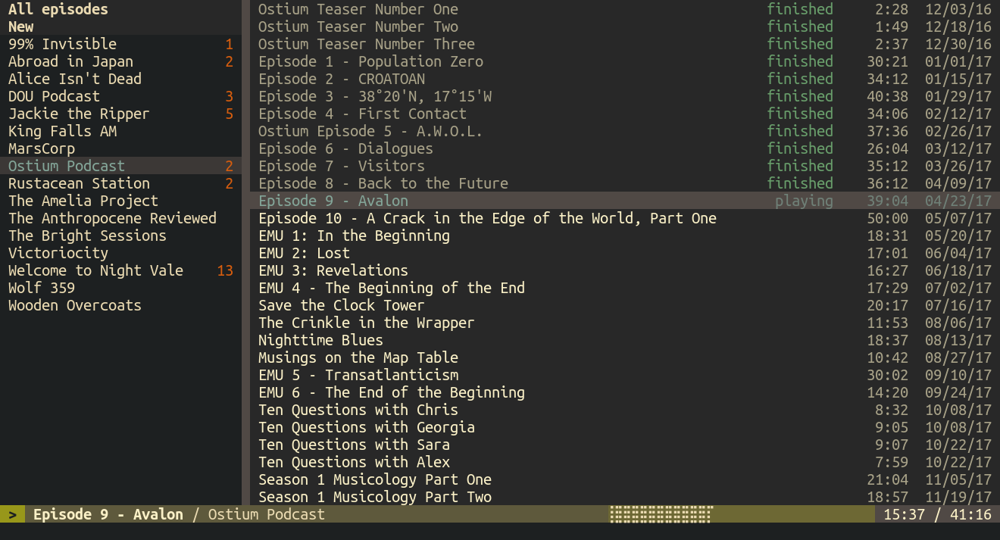

# Hedgehog

Hedgehog is a podcast player and organizer with a terminal-based user
interface. 

<p align="center">
  
</p>


 * **Subscription management and automatic feed updates.** Using Hedgehog you
   can subscribe to RSS feeds, they will automatically be updated on startup or
   upon request.
 * **Keeping track of the status of each episode.** Hedgehog remembers whether
   you have played each episode before, whether you finished, or where you
   stopped. It can then resume playback from that point.
 * **Searching online for new feeds to subscribe to.** Hedgehog can search for
   podcasts by their titles online, so there is no need to look for the RSS
   link.
 * **Flexible theming.** The visual style of any component of the Hedgehog's UI
   can be recolored in a state-dependent manner. There are several built-in
   themes. They are listed in [THEMES.md](THEMES.md). The manual contains a
   detailed reference for creating custom themes.
 * **Fully configurable keybindings.** Hedgehog is almost exclusively
   controlled through issuing commands either directly or through key bindings.
   All of these keybindings can be changed by the user's configuration.
 * **Integration with external programs through MPRIS.** On Linux and other
   operating systems with dbus integration, Hedgehog reports its status through
   MPRIS and accepts commands from external software.
 * **Mouse support in the terminal-based UI.** Hedgehog is a terminal
   application, and it's designed to be fully controlled via the keyboard. But
   much of its functionality (playback control, navigation, episode and feed
   selection, etc.) can be accessed through mouse actions.


## Manual

Hedgehog comes with a user manual in the form of a man page that can be viewed
via `man hedgehog 1` on a UNIX-like platforms. It's also available online at
[poletaevvlad.github.io/Hedgehog/hedgehog.1.html](https://poletaevvlad.github.io/Hedgehog/hedgehog.1.html).


## Installation

### Dependencies

Hedgehog has some runtime dependencies that must be installed before Hedgehog
can be either compiled from source or installed from binary distribution.

* [SQLite libs](https://www.sqlite.org/download.html)
* [dbus](https://www.freedesktop.org/wiki/Software/dbus/#download) (For MPRIS support)
* [OpenSSL](https://www.openssl.org/source/)
* [GStreamer](https://gstreamer.freedesktop.org/download/) and Gstreamer's good plugins

Please note, that these libraries are common enough for you to be able to
install them through your operating system package manager.

On Windows you can install GStreamer using the official installer or via a
package manager. Make sure to add GStreamer's bin directory to the "PATH"
environment variable.

### Building from source

To build Hedgehog from sources you will need a rust compiler and cargo package
manager. You should also have all dependencies installed before compiling
Hedgehog. Otherwise, there is no additional configuration required.

Hedgehog can be built and launched using cargo (`cargo run --release`). Cargo
will build the application and its environment. If you wish to install Hedgehog
for greater convenience you'll need to build and install configuration files 
(themes and rc). `cargo install` isn't suitable for that. There are scripts for
correctly building Hedgehog included in the source code for each of the 
supported operating systems.

#### Linux

This repository contains a makefile with building and installation targets. It
will install Hedgehog binary, default configuration files and themes, and a 
manpage into standard directories (`/usr/bin`, `/usr/share/`, etc.)

```bash
$ git clone https://github.com/poletaevvlad/Hedgehog.git
$ cd Hedgehog   
$ make
$ sudo make install
```

For these commands to succeed, you need to have
['jq'](https://stedolan.github.io/jq/) installed.

#### Windows

For building Hedgehog for Windows you need to execute `build-win` script:
`build-win x86_64` for 64-bit systems and `build-win i686` for 32-bit. It will
generate the executable and configuration files in the "build" directory. Note
that you need to have ['jq'](https://stedolan.github.io/jq/) and development
files of GStreamer installed for this process to succeed. You also need to
install `pkg-config` and setup `PATH` and `PKG_CONFIG_PATH` for GStreamer.

#### MacOS

Hedgehog under MacOS should work, but it's not officially supported. If you
wish to test it and create a CI pipeline for it, you are more than welcome to
do so.


### Using pre-compiled binaries

You may wish to avoid installing all necessary build tools and libraries needed
to compile Hedgehog from sources. In such cases, you may use one of the
pre-compiled packages from the "Releases" section of the GitHub repository.
Make sure to choose the correct package for your operating system and processor
architecture.

For Linux, the pre-compiled archives contain an executable `install.sh` script
intended to install binaries, configuration, and documentation into the system
directory. You can change the installation destination by setting the `PREFIX`
environment variable. Installing Hedgehog this way also creates a script
`/usr/share/hedgehog/uninstall.sh` which removes all installed files but keeps
user-specific data and configuration. It requires the same `PREFIX` as was
passed to install.sh.

For Windows, the binary distribution can be installed at any position of your
choosing just by unzipping the archive.


## Bugs and contribution

If you found a bug or have a suggestion for a feature you'd like to see
implemented, don't hesitate to open an issue on GitHub at
<https://github.com/poletaevvlad/Hedgehog/issues>.

You are also invited to participate in the development of Hedgehog if you want
to make a small improvement to the code or documentation, by contributing in
the form of a pull request into this repository. If you wish to work on the
more substantial change, you are also welcome to do so, but filing an issue
first would be best.

Hedgehog is open-source software and its source code is published under Apache
License 2.0. All contributions are assumed to be made under this license.
