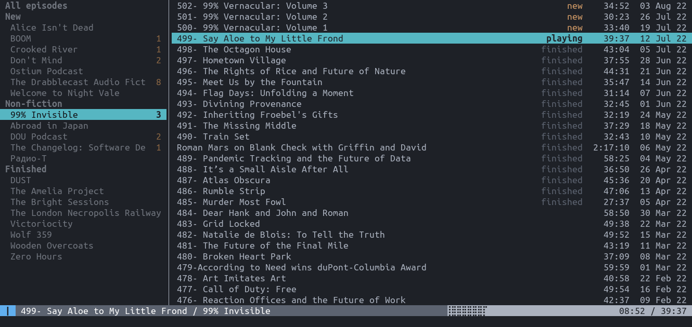
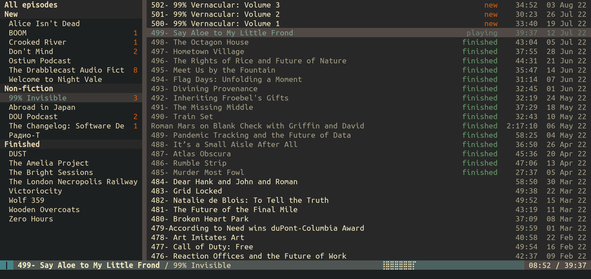
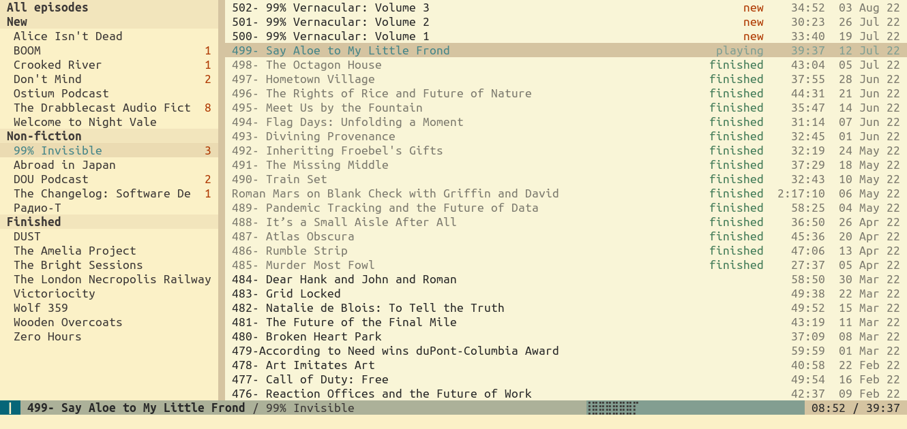
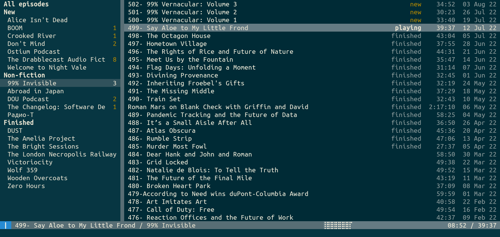

# Built-in themes

Hedgehog comes with a set of built in themes which are listed bellow. You may
activate a theme by issuing the command `theme load <name>`. Note, that in
order for the selected theme to persis across restart, you need to update your
`rc` file. You can refer to 
[the manual](https://poletaevvlad.github.io/hedgehog/hedgehog.1.html) for more
details on theming.

## `default`

This theme is loaded by default. It should be compatible with most terminal
emulators.

## gruvbox

This themes are based on the "Gruvbox" VIM theme developed by Pavel Pertsev
(@morhetz). See the original at
[github.com/morhetz/gruvbox](https://github.com/morhetz/gruvbox).

### `gruvbox-dark`

### `gruvbox-light`

## `nord`

This teme is based on the Nord color scheme developed by Arctic Ice Studio. The
theme is  documented at [www.nordtheme.com](https://www.nordtheme.com/).

## solarized

These themes is based on Solarized theme developed by Ethan Schoonover. It's
documented at
[ethanschoonover.com/colophon/](https://ethanschoonover.com/colophon/).

### `solarized-dark`

### `solarized-light`

[][]

